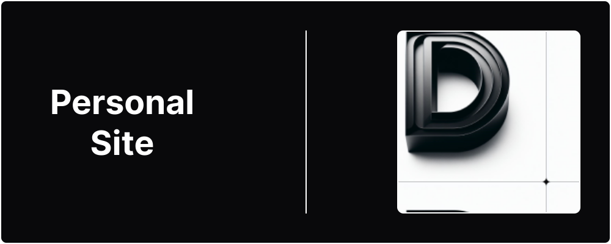
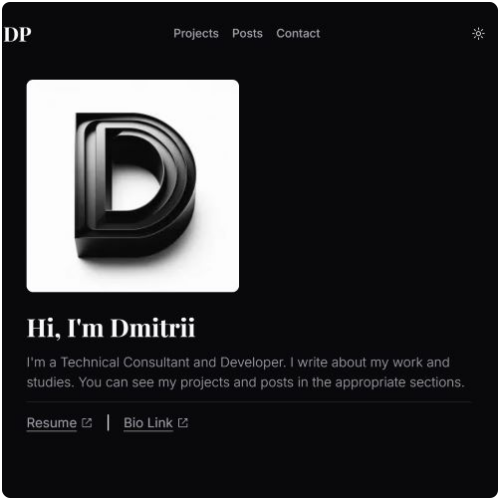
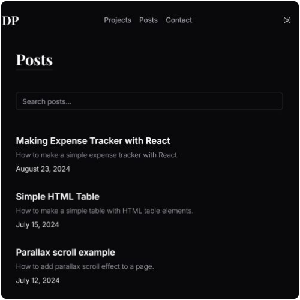

  

# Personal Site

Next.js / TypeScript web site

## 📋 Table of Contents

- [Introduction](#introduction)
- [Features](#features)
- [Screenshots](#screenshots)
- [Tech Stack](#tech-stack)
- [Live Version](#live-version)
- [Contact Info](#contact-info)

## 🔎 Introduction

This is my personal site made with Next.js and TypeScript.

## 📌 Features

- Main page with introduction and main sections display
- Projects pages with details about each project
- Blog pages with various blog posts
- Contact form with additional email link
- Dark/light mode

## 📷 Screenshots

### Home page

**Caption:** Home page of the site.

### Posts page

**Caption:** Page with a list of all posts.

## ⚙️ Tech Stack

- Next.js
- TypeScript
- Tailwind CSS
- shadcn/ui
- Radix UI
- React Icons
- Prettier
- Vercel

## 🔗 Live Version

### [Personal Site](https://www.dimterion.com/)

## 📫 Contact info

### Profile links ⬇️

**Note:** Ctrl+Click (Windows/Linux) or Cmd+Click (macOS) the image to open link in a new tab.
